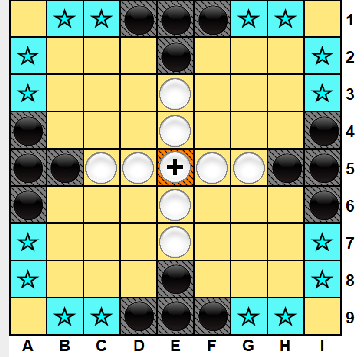

# MarenTablutAI


### What is Tablut?

MarenTablutAI is an artificial intelligence written in Java that plays Tablut, a variant of the classic Viking boardgame Hnefatafl. 

Games's rules [here](https://en.wikipedia.org/wiki/Tafl_games)


<p align="center"> 
   
</p>


### How to run the server

First install Gradle

Gradle Installation [here](https://gradle.org/install/ )

Go into the project folder:
```
cd TablutAI/Tablut
```

Run the **server**:
```
gradle Server
```

To visualize the **GUI**, run:
```
gradle Server --args="-g true"
```


### Run MarenTablutAI

Download the **latest release** [here](https://github.com/lucamarini22/TablutAI/releases)

and then run:
`
java -jar Tablut-MarenAI.jar <black|white> <timeout-per-move-in-seconds> <server-ip>
`
